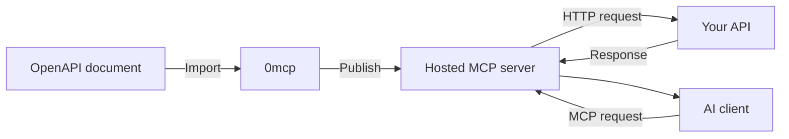

  <a href="https://0mcp.io">
    <picture>
      <source media="(prefers-color-scheme: dark)" srcset="logo/dark.svg">
      <source media="(prefers-color-scheme: light)" srcset="logo/light.svg">
      
    </picture>
  </a>

  <h3>Turn your API into a hosted MCP server</h3>

  

    Import an OpenAPI document, choose what AI clients can access, 
    and publish a managed MCP endpoint in minutes.
  

  

    <a href="https://0mcp.io/dashboard"><strong>Create a server</strong></a>
    &middot;
    <a href="get-started/quick-start.mdx">Quick start</a>
    &middot;
    <a href="https://0mcp.io/pricing">Pricing</a>
    &middot;
    <a href="mailto:hello@0mcp.io">Support</a>
  

  

    
    
    
  

## What is 0mcp?

[0mcp](https://0mcp.io) turns an existing REST API into a hosted [Model Context Protocol](concepts/what-is-mcp.mdx) server. You provide an OpenAPI 3.x or Swagger 2.0 document, select the operations you want to expose, and 0mcp converts them into tools that compatible AI clients can discover and call.

You do not need to change your API or maintain a separate MCP service. Your API remains responsible for its data, business logic, authentication, and authorization.

## From API to MCP in six steps

| Step | What you do |
| ---: | --- |
| **1. Create** | Sign in to the [0mcp dashboard](https://0mcp.io/dashboard) and create a server. |
| **2. Import** | Upload, paste, or link to an OpenAPI 3.x or Swagger 2.0 document in JSON or YAML. |
| **3. Choose** | Select the operations that should become MCP tools. Rename them or improve their descriptions when needed. |
| **4. Publish** | Publish a version to make the server available at its hosted endpoint. |
| **5. Test** | Use the Playground to test read-only tools and verify authentication before allowing write operations. |
| **6. Connect** | Copy the generated setup for your AI client, add credentials securely, and reconnect the client. |

For the complete walkthrough, follow the [quick start](get-started/quick-start.mdx).

## What you can build

<strong>Tools</strong> - let AI clients perform actions through your API

Each selected API operation becomes an MCP tool with a name, description, inputs, request schema, response schema, and authentication requirements. You can disable sensitive operations, set timeouts and response-size limits, and control redirects without changing the upstream API.

[Learn about tools](capabilities/tools.mdx)

<strong>Resources</strong> - provide stable, read-only context

Share documentation, policies, FAQs, pricing information, or other reference content through stable resource URIs. Resources can contain text, Markdown, JSON, YAML, or base64-encoded file data.

[Learn about resources](capabilities/resources.mdx)

<strong>Prompts</strong> - give clients reusable instructions

Create prompt templates for repeatable workflows such as summarizing support cases, drafting replies, reviewing logs, or generating release notes. Arguments let clients reuse one prompt with different values.

[Learn about prompts](capabilities/prompts.mdx)

## Built for controlled releases

- **Draft safely.** Changes stay private until you publish a version.
- **Test before release.** The Playground runs the currently published tools, resources, and prompts.
- **Roll back quickly.** Publish an earlier version to restore a known configuration.
- **Pause serving.** Stop incoming requests without deleting the server or changing its published version.
- **Monitor usage.** Analytics show trends, while logs help you investigate individual events.
- **Use your own domain.** Point a stable hostname such as `mcp.example.com` to your server.

<strong>Explore operations guides</strong>

- [Playground](guides/playground.mdx)
- [Versioning and rollback](guides/versioning.mdx)
- [Analytics](guides/analytics.mdx)
- [Logs and privacy](guides/logs.mdx)
- [Custom domains](guides/custom-domain.mdx)

## Connect your preferred AI client

0mcp works with **any MCP client that supports remote Streamable HTTP**. Your server is not tied to a specific AI application, editor, or agent framework.

To connect a compatible client:

1. Publish a version of your MCP server.
2. Copy the hosted endpoint from your server's **Setup** page.
3. Add the endpoint to your client's MCP configuration.
4. Configure any authentication headers or environment variables required by your upstream API.
5. Reconnect the client so it can discover your published tools, resources, and prompts.

The **Setup** page provides ready-to-use configuration for popular clients. You can use the same endpoint with any other MCP-compatible client that supports the transport and authentication requirements. See the [client setup overview](guides/setup.mdx) for details.

## Your credentials stay with the caller

0mcp uses [pass-through authentication](concepts/authentication-model.mdx). The MCP client supplies the Bearer token or API key required by your API, and 0mcp forwards it for that request. Your upstream API makes the final authorization decision.

0mcp does **not** store:

- Bearer tokens, API keys, or authentication headers
- Request bodies or response bodies
- Playground credentials as activity data

Operational records contain only the details needed to understand usage and failures, such as timestamps, capability names, status codes, response times, and data sizes.

> [!WARNING]
> Review tools that create, update, delete, send, or charge data before publishing them. Test with limited credentials and keep secrets out of shared configuration files.

## Supported API sources

| Source | Availability | Next step |
| --- | --- | --- |
| OpenAPI 3.x | Available | [Prepare an OpenAPI document](api-sources/openapi.mdx) |
| Swagger 2.0 | Available | [Review import requirements](api-sources/openapi.mdx) |
| Direct REST API import | Planned | [Use OpenAPI today](api-sources/rest-api.mdx) |
| GraphQL schema import | Planned | [Review current options](api-sources/graphql.mdx) |
| Postman Collection import | Planned | [Convert to OpenAPI first](api-sources/postman.mdx) |

## Find your path

<strong>I am new to MCP</strong>

1. Read [What is MCP?](concepts/what-is-mcp.mdx).
2. See [how 0mcp connects a client to your API](concepts/how-0mcp-works.mdx).
3. Follow the [quick start](get-started/quick-start.mdx) with one or two read-only operations.

<strong>I am preparing my first production server</strong>

1. Give every imported operation a clear, unique `operationId`.
2. Expose only the operations clients need.
3. Verify the [authentication model](concepts/authentication-model.mdx).
4. Test with limited credentials in the [Playground](guides/playground.mdx).
5. Publish a version and reconnect your client.
6. Watch [Analytics](guides/analytics.mdx) and [Logs](guides/logs.mdx) after release.

<strong>Something is not working</strong>

- Import rejected? Check [Invalid OpenAPI](troubleshooting/invalid-openapi.mdx).
- Client cannot connect? Follow [MCP connection issues](troubleshooting/mcp-connection-issues.mdx).
- Requests return `401` or `403`? Review [Authentication errors](troubleshooting/authentication-errors.mdx).
- Server connects but tools are missing? Check [Tool discovery problems](troubleshooting/tool-discovery-problems.mdx).

## Frequently asked questions

<strong>Do I need to change my existing API?</strong>

No. 0mcp provides an MCP-compatible interface over your API. Your existing endpoints, business rules, and authorization remain in place.

<strong>Can I expose only selected endpoints?</strong>

Yes. You decide which imported operations become tools, and you can disable a tool later. Leave internal, administrative, payment, and other sensitive operations out unless clients need them.

<strong>When do my changes become live?</strong>

Only when you publish a version. Draft edits do not change the live endpoint. Clients may need to reconnect before they discover an updated capability list.

<strong>Can I try 0mcp without a credit card?</strong>

Yes. You can explore 0mcp without a credit card. Visit the [pricing page](https://0mcp.io/pricing) for current plans, allowances, and prices.

Read the complete [FAQ](resources/faq.mdx) for answers about servers, clients, security, usage, and billing.

## Get started

Create your first hosted MCP server at [0mcp.io](https://0mcp.io), or begin with the [quick-start guide](get-started/quick-start.mdx).

Need help? Email [hello@0mcp.io](mailto:hello@0mcp.io).
